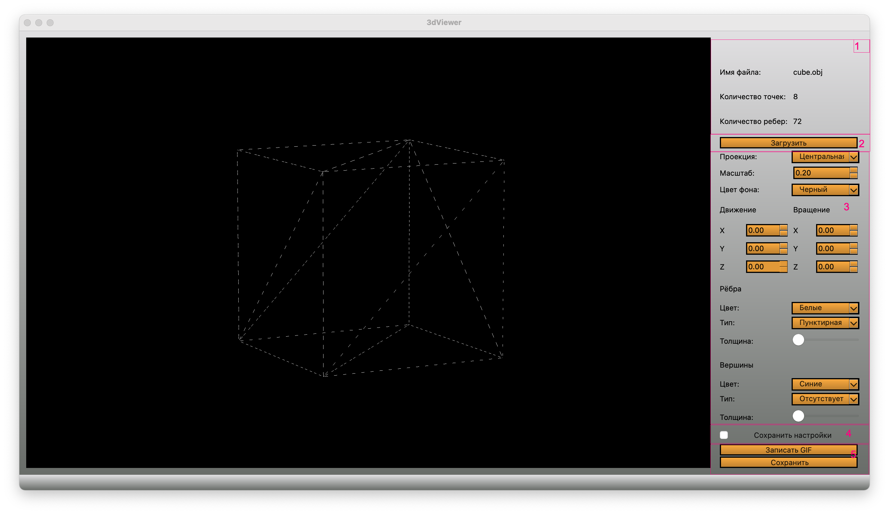

# 

 ### Над проектом работали:
 
 - romildab@student.21-school.ru - реализация парсера для .obj файлов
 - shanelac@student.21-school.ru - front часть проекта, дизайн и запись гифок
 - tandrasc@student.21-school.ru - работа с openGL, работа над отображением и отрисовкой моделей, реализация перемещения фигуры в 3-х мерном пространстве, реализация drag & drop

## Реализация

Программа разработана для визуализации каркасной модели в трехмерном пространстве:

Программа разработана на языке `C` с использованием библиотеки `Qt`
Код программы находится в папке *Src*
Сборка и взаимодействие программы происходит через `Makefile`
В один момент времени должна быть только одна модель на экране.

Программа представляет возможность:

 - Загружать каркасную модель из файла формата obj (поддержка только списка вершин и поверхностей).
 - Перемещать модель на заданное расстояние относительно осей X, Y, Z.
 - Поворачивать модель на заданный угол относительно своих осей X, Y, Z
 - Масштабировать модель на заданное значение.

В программе реализован графический интерфейс на базе GUI-библиотеки `Qt` при помощи `QtCreator`
Графический пользовательский интерфейс содержит:

 - Кнопку для выбора файла с моделью и поле для вывода его названия.
 - Зону визуализации каркасной модели.
 - Кнопку/кнопки и поля ввода для перемещения модели.
 - Кнопку/кнопки и поля ввода для поворота модели.
 - Кнопку/кнопки и поля ввода для масштабирования модели.
 - Информацию о загруженной модели - название файла, кол-во вершин и ребер.

Программа корректно отрабатывает без зависаний модели с деталями до 100, 1000, 10 000, 100 000, 1 000 000, 2 500 000 (зависание - это бездействие интерфейса более 0,5 секунды).
Дополнительные настройки включают в себя:

 - Программа позволяет настраивать тип проекции (параллельная и центральная)
 - Программа позволяет настраивать тип (сплошная, пунктирная), цвет и толщину ребер, способ отображения (отсутствует, круг, квадрат), цвет и размер вершин
 - Программа позволяет выбирать цвет фона
 - Настройки сохраняются между перезапусками программы
 - Программа позволяет сохранять полученные ("отрендеренные") изображения в файл в форматах bmp и jpeg
 - Программа позволяет по специальной кнопке записывать небольшие "скринкасты" - текущие пользовательские аффинные преобразования загруженного объекта в gif-анимацию (640x480, 10fps, 5s)

 UI программы выглядит следующим образом:

 

 **Детальное описание находится на html-странице, которую можно запустить Makefile целью `dvi`**
